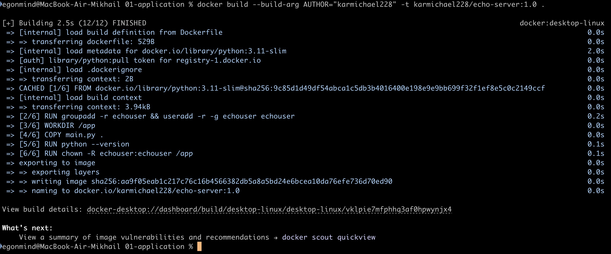
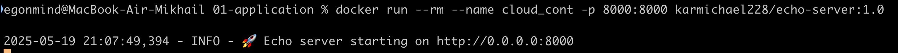
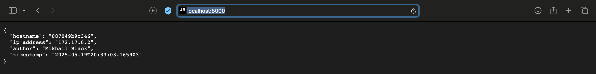
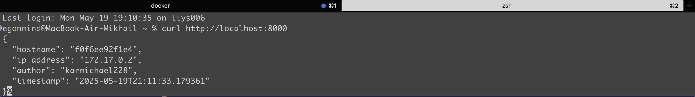
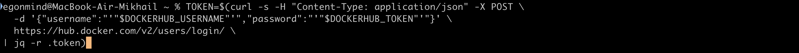
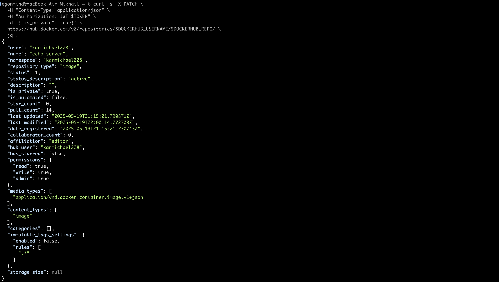
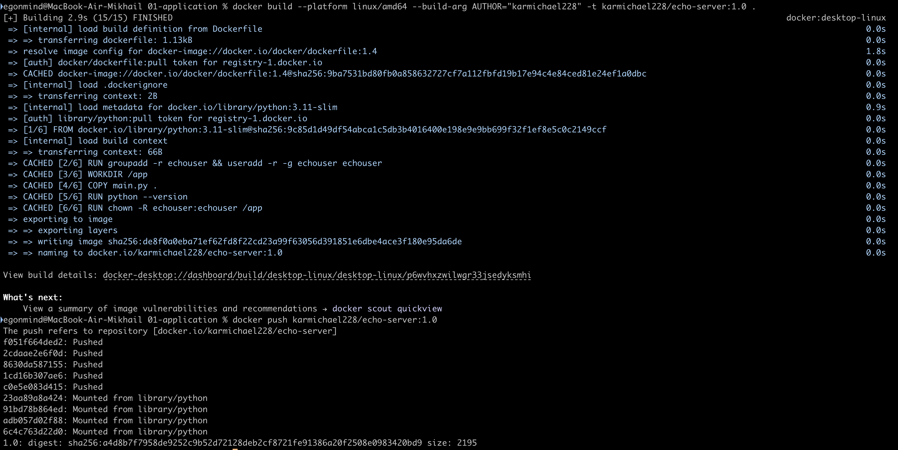

## Сборка Docker-образа

Создаю образ, вводя аргумент сборки для установки переменной окружения `AUTHOR`:

```bash
docker build --build-arg AUTHOR="karmichael228" -t karmichael228/echo-server:1.0 .
```



## Запуск контейнера

Запускаю контейнер локально:

```bash
docker run --rm --name cloud-cont -p 8000:8000 karmichael228/echo-server:1.0
```



Захожу в браузере по адресу http://localhost:8000 и убеждаюсь, что все работает


## Тестирование сервиса

Проверяю сервер при помощи curl:

```bash
curl http://localhost:8000
```



## Публикация в Docker Hub

Выполняю аутентификацию:

```bash
docker login
```

После отправляю образ на DockerHub:

```bash
docker push karmichael228/echo-server:1.0
```

Получаю JWT-токен


Делаю репозиторий приватным:


## P.S.

В дальнейшем(в пункте 2) столкнулся с конфликтами архитектур, так как работаю на arm64. Поэтому я пересобрал образ учитывая архитектуру linux/amd64 облачного сервера от cloud.ru и заново запушил образ на Docker Hub в свой приватный репозиторий:


