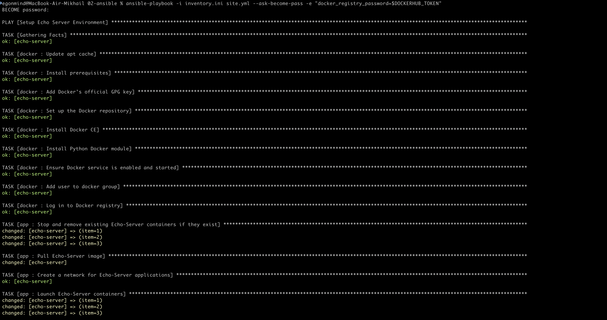
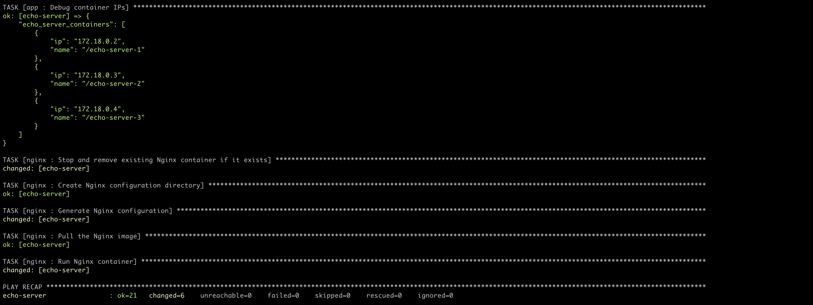
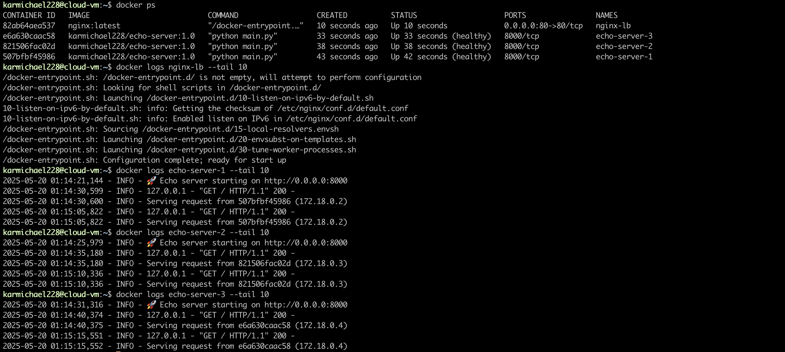

# Развертывание Echo Server с Ansible

В данном пункте я реализовал при помощи ansible плэйбука следующее:

- Установку Docker CE
- Деплой трех контейнеров Echo Server
- Деплой Nginx в качестве балансировщика нагрузки с алгоритмом least connections

Все это поднималось на арендованном облачном сервере от cloud.ru

## Структура проекта

```
02-ansible/
├── group_vars/
│   └── all/
│       └── vars.yml            # Глобальные переменные
├── inventory.ini               # Инвентарь серверов
├── roles/
│   ├── app/
│   │   └── tasks/
│   │       └── main.yml        # Задачи для развертывания Echo Server
│   ├── docker/
│   │   └── tasks/
│   │       └── main.yml        # Задачи для установки Docker
│   └── nginx/
│       └── tasks/
│           └── main.yml        # Задачи для настройки Nginx
├── templates/
│   └── nginx.conf.j2           # Шаблон конфигурации Nginx
└── site.yml                    # Главный плейбук
```

## Запуск плэйбука

```bash
ansible-playbook -i inventory.ini site.yml --ask-become-pass -e "docker_registry_password=$DOCKERHUB_TOKEN"
```




## Проверка на сервере




## Обоснование выбора алгоритма балансировки нагрузки

Для приложения Echo Server выбран алгоритм **least connections** по следующим причинам:

1. **Распределение запросов в зависимости от загрузки сервера**  
   Алгоритм наименьших соединений направляет трафик на сервер с наименьшим количеством активных соединений, что важно, когда время обработки запросов может различаться.

2. **Адаптация к производительности контейнеров**  
   Если один из контейнеров обрабатывает запросы медленнее (из-за ограничений системы или других факторов), алгоритм автоматически снизит количество запросов к нему, предотвращая перегрузку.

3. **Обработка запросов разной сложности**  
   Алгоритм обеспечивает равномерное распределение запросов, даже если некоторые из них занимают больше времени (например, при задержках при получении системной информации).

4. **Улучшенная отказоустойчивость**  
   Если контейнер работает медленнее, алгоритм автоматически снижает к нему трафик, без необходимости явно помечать контейнер как недоступный.

5. **Динамическая адаптация**  
   В отличие от round-robin, который распределяет запросы независимо от нагрузки, алгоритм наименьших соединений реагирует на реальную загрузку в режиме реального времени.