# Развёртывание Echo-Server в Kubernetes

В этой директории находятся манифесты Kubernetes для развёртывания приложения Echo-Server.

## Выполненные требования

### 1. Проброс переменной AUTHOR

В файле `deployment.yaml` настроен проброс переменной окружения AUTHOR:

```yaml
env:
- name: AUTHOR
  value: "karmichael228"
```


### 2. Readiness и Liveness пробы

В файле `deployment.yaml` настроены пробы:

```yaml
readinessProbe:
  httpGet:
    path: /
    port: 8000
  initialDelaySeconds: 10
  periodSeconds: 5
  # ...

livenessProbe:
  httpGet:
    path: /
    port: 8000
  initialDelaySeconds: 30
  periodSeconds: 15
  # ...
```

### 3. Использование образа из приватного репозитория

Настроено использование приватного регистра с помощью секции `imagePullSecrets` в `deployment.yaml`

### 4. Ingress Controller
Настроен Ingress-ресурс в файле `ingress.yaml`

### 5. Helm Chart (опционально)
Предоставлен Helm Chart в директории `helm-chart`

## Инструкция по развертыванию

### Необходимые требования
- Установленный Minikube
- Установленный kubectl
- Установленный Docker
- Образ приложения `karmichael228/echo-server:1.0` должен быть доступен

### 1. Запуск Minikube и подготовка окружения

```bash
# Запуск кластера Minikube
minikube start

# Проверка статуса кластера
minikube status
```

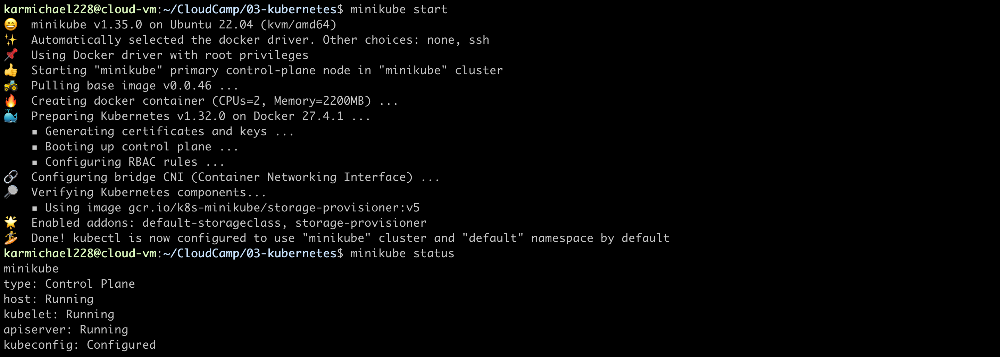

### 2. Создание пространства имен

```bash
# Создание namespace
kubectl apply -f namespace.yaml

# Проверка создания namespace
kubectl get namespaces | grep echo-server
```


### 3. Настройка доступа к приватному Docker-регистру

```bash
# Создаю секрет для доступа к DockerHub
kubectl create secret docker-registry docker-registry-secret \
  --namespace=echo-server \
  --docker-server=https://index.docker.io/v1/ \
  --docker-username=karmichael228 \
  --docker-password=$DOCKERHUB_PASSWORD \
  --docker-email=$DOCKERHUB_EMAIL

# Проверяю, что секрет создан
kubectl get secrets -n echo-server
```

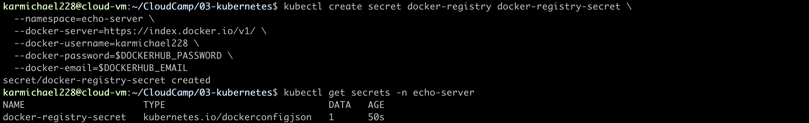

### 4. Загрузка образа в Minikube

```bash
minikube image load karmichael228/echo-server:1.0

# Проверяю доступность
minikube ssh -- docker images | grep echo-server
```


### 5. Развертывание приложения

```bash
kubectl apply -f deployment.yaml

# Проверяю, что поды запущены
kubectl get pods -n echo-server
```

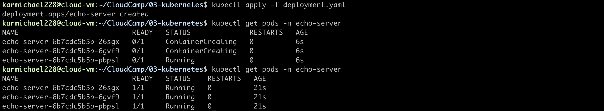

### 6. Создание сервиса

```bash
kubectl apply -f service.yaml

# Проверяю создание сервиса
kubectl get services -n echo-server
```


### 7. Настройка Ingress

```bash
# Включаю Ingress-контроллер в Minikube
minikube addons enable ingress

# Создаю Ingress-ресурс
kubectl apply -f ingress.yaml

# Проверяю создание Ingress
kubectl get ingress -n echo-server
```

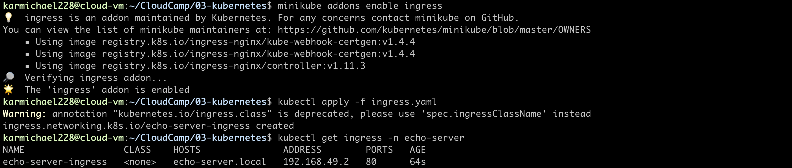

### 8. Добавление записи в hosts файл

Делаю для того, чтобы был доступ через домен

```bash
# Получаю IP-адрес Minikube
MINIKUBE_IP=$(minikube ip)

# Добавляю записи в /etc/hosts
echo "$MINIKUBE_IP echo-server.local" | sudo tee -a /etc/hosts

# Проверяю добавление записи
cat /etc/hosts | grep echo-server
```


### 9. Проверка работы приложения

```bash
# Проверяю доступ через Ingress
curl http://echo-server.local

```

Все работает коррректно

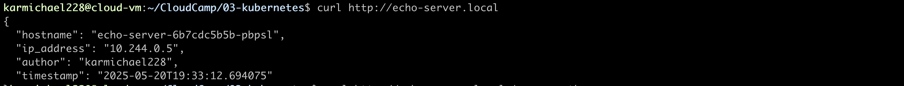

### 10. Очистка ресурсов

```bash
kubectl delete namespace echo-server
```


Чтобы не было конфликтов

## Альтернативное развертывание с помощью Helm Chart

### 1. Установка Helm

```bash
sudo snap install helm --classic

helm version
```


### 2. Развертывание с помощью Helm Chart

```bash
#Устанавливаю чарт и создаю секрет для доступа к DH
helm install echo-server ./helm-chart/echo-server --create-namespace --namespace echo-server
kubectl create secret docker-registry docker-registry-secret \
  --namespace=echo-server \
  --docker-server=https://index.docker.io/v1/ \
  --docker-username=karmichael228 \
  --docker-password=$DOCKERHUB_PASSWORD \
  --docker-email=$DOCKERHUB_EMAIL

# Проверяю, что все выполнено корректно
helm list --namespace echo-server
kubectl get all -n echo-server
```

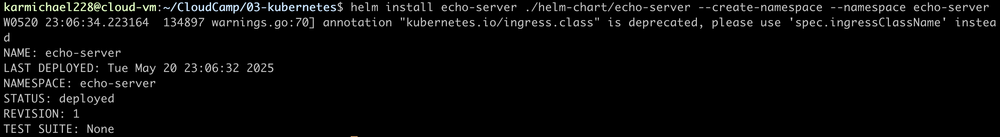
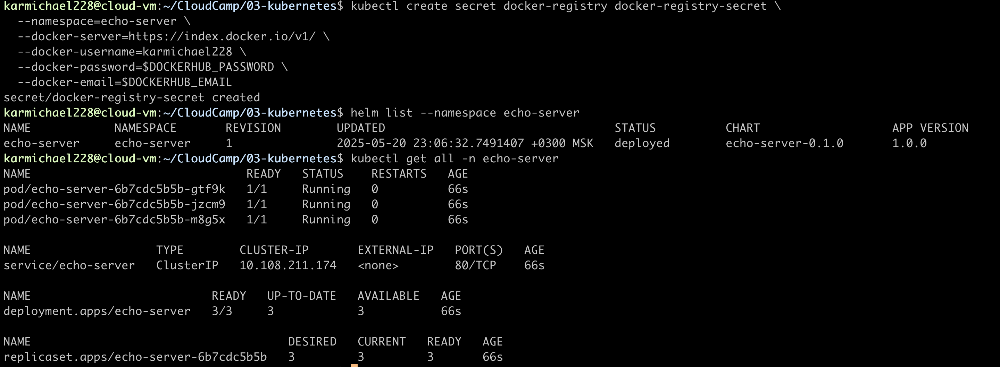

## Проверка выполнения требований

### 1. Проверка проброса переменной AUTHOR

```bash
kubectl exec -n echo-server $(kubectl get pods -n echo-server -o name | head -n 1) -- env | grep AUTHOR

curl http://echo-server.local | grep author
```

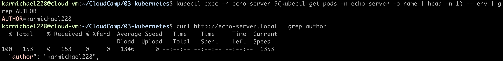

### 2. Проверка работы проб

```bash
kubectl describe pod -n echo-server $(kubectl get pods -n echo-server -o name | head -n 1 | cut -d/ -f2)
```

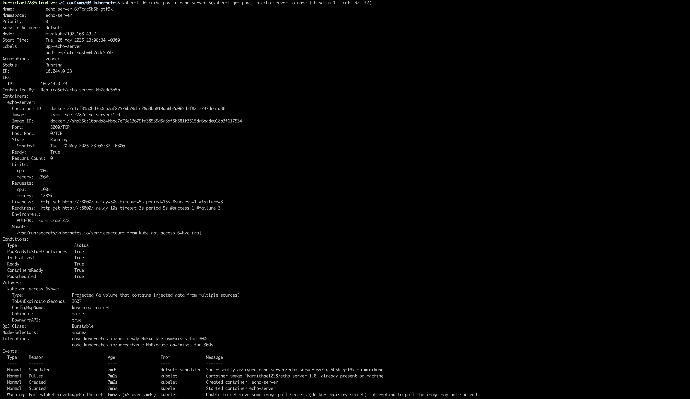

### 3. Проверка использования приватного регистра

```bash
kubectl get pod -n echo-server $(kubectl get pods -n echo-server -o name | head -n 1 | cut -d/ -f2) -o yaml | grep -A 2 imagePullSecrets
```

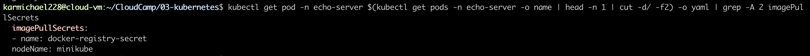

### 4. Проверка работы Ingress

```bash
#Проверяю стасус Ingress
kubectl get ingress -n echo-server

#Проверяю доступ через Ingress
curl -v http://echo-server.local
```

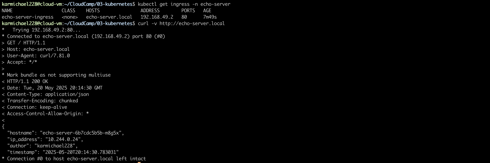


## Очистка

В конце очищаю namespace и minikube кластер, чтобы он не тратил системные ресурсы

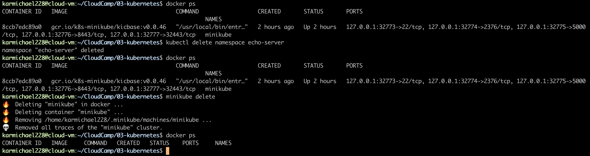
