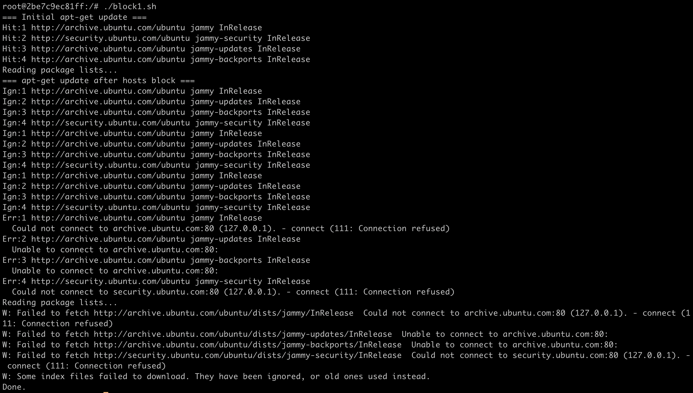
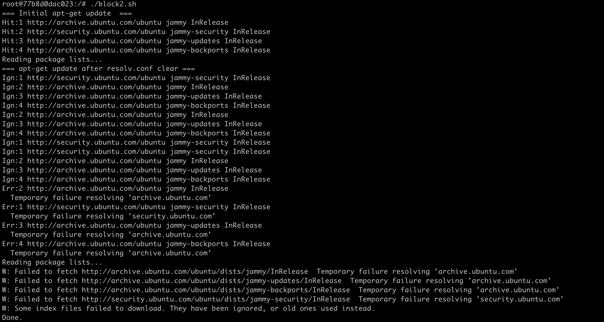

# Блокировка apt внутри контейнера Ubuntu

Я создал два контейнера на облачном сервере и реализовал два способа блокировки менеджера пакетов apt

---

## Способ 1: Перенаправление репозиториев через `/etc/hosts`

Я написал bash-скрипт который:
1. показывает, что apt работает корректно
2. редактирует файл /etc/hosts так, чтобы запросы к нужным доменам резолвились в локальный ip, и тем самым запирает контейнер, делая невозможным установку пакетов

```bash
cat <<EOF >> /etc/hosts
127.0.0.1 archive.ubuntu.com
127.0.0.1 security.ubuntu.com
EOF
```

3. показывает, что менеджер пакетов теперь не функционирует

### Скрины с подтверждением




## Способ 2: Очистка DNS-серверов в /etc/resolv.conf

Второй bash-скрипт очищает содержимое /etc/resolv.conf, удаляя все DNS-сервера:


```bash
: > /etc/resolv.conf
```

### Скрины с подтверждением




## P.S.

Первый способ я считаю предпочтительным, так как он является более гибким